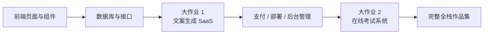

# 初中级开发

欢迎来到 **初中级开发** 阶段！在这里，你将深入全栈开发，掌握前端组件化、数据库设计、后端 API 开发与部署上线。

## 你将学到什么

### 前端开发

掌握现代前端开发，学习组件库与设计工具的使用：

  

  

  

  

  

  

  

  

### 后端开发

学习 API 设计、数据库管理以及应用部署策略：

  

  

  

  

  

  

### 大作业

前面的章节是在学“零件”，大作业才是在学“怎么把零件装成一个能跑、能演示、能上线的产品”。

建议你按 **大作业 1 -> 大作业 2** 的顺序来做：

- **大作业 1** 先带你跑通现代 SaaS 最常见的主链路：登录、生成、数据库、支付、管理后台。
- **大作业 2** 再带你进入更像业务系统的场景：角色权限、题库、考试、提交记录、管理台。

如果你不知道先做哪个，可以直接参考下面这张对比表：

| 项目 | 你会重点练到什么 | 最适合谁 | 最终交付物 |
|------|------|------|------|
| 大作业 1：文案生成网站 | SaaS 页面结构、用户登录、AI 生成、Stripe 支付、后台管理 | 第一次做完整商业化网站的人 | 一个可注册、可生成、可付费、可管理的 SaaS 雏形 |
| 大作业 2：在线考试与管理系统 | 角色权限、题库建模、考试流程、提交记录、批改与统计 | 想把“业务系统”真正做完整的人 | 一个有学生端和管理端的考试平台 |

无论做哪一个，大作业都建议至少准备这 3 个交付物：

- 一个可运行的项目仓库
- 一个可访问的演示链接
- 一份 README 和一段演示视频

  

  

如果你已经完成了上面两个主线项目，或者想按自己的技术方向做作品集，可以继续从下面这些扩展选题里选一题深入：

  

  

  

  

  

  

### AI 能力扩展

  

## 适合人群

- 有一定编程基础，想系统学习全栈开发的开发者
- 希望从产品经理转型为全栈工程师的学习者
- 想要掌握现代开发工具和工作流的初中级开发者
- 希望独立开发完整产品的创业者

## 前置要求

- 完成「新手与产品原型」阶段，或具备同等基础知识
- 了解基本的 HTML/CSS/JavaScript 概念
- 对 AI 编程工具有初步了解

准备好深入全栈开发了吗？点击左侧导航开始学习吧！

---

📄 This content is adapted from the <a href="https://github.com/datawhalechina/easy-vibe" target="_blank" rel="noopener noreferrer">Easy-Vibe project</a> by <strong>Datawhale</strong>, licensed under <a href="https://creativecommons.org/licenses/by-nc-sa/4.0/" target="_blank" rel="noopener noreferrer">CC BY-NC-SA 4.0</a>.

You are free to share and adapt this material with attribution, for non-commercial purposes, under the same license.

